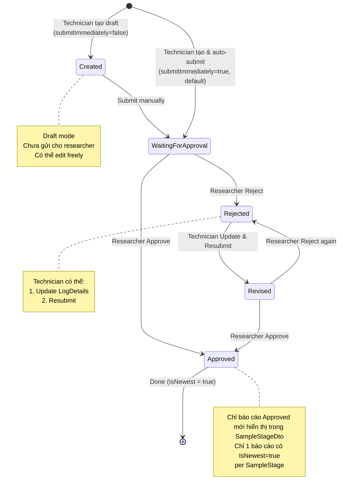

# 📚 MONITORING LOG WORKFLOW - COMPLETE FRONTEND INTEGRATION GUIDE

> **Version:** 1.0  
> **Last Updated:** 2025-01-17  
> **Backend:** .NET 8, Clean Architecture, DDD  
> **Status Format:** STRING (not int)

---

## 🎯 OVERVIEW

**Monitoring Log** là workflow cho phép:
- **Technician** tạo báo cáo giám sát mẫu (monitoring log) và gửi cho researcher duyệt
- **Researcher** duyệt hoặc từ chối báo cáo
- **Technician** chỉnh sửa và gửi lại nếu bị từ chối

---

## 🔄 STATE MACHINE



---

## 📊 STATUS ENUM

### Backend Definition

```csharp
public enum MonitoringLogStatus
{
    Created = 0,            // Vừa tạo, chưa gửi (draft)
    WaitingForApproval = 1, // Lần đầu gửi, chờ duyệt
    Approved = 2,           // Đã được duyệt
    Rejected = 3,           // Bị từ chối, cần chỉnh sửa
    Revised = 4             // Đã chỉnh sửa và gửi lại
}
```

### ⚠️ CRITICAL: Status Response Format

**API trả về status dạng STRING, KHÔNG phải INT:**

```json
{
  "status": "WaitingForApproval",  // ✅ STRING
  // NOT "status": 1
}
```

### Frontend TypeScript Interface

```typescript
type MonitoringLogStatus = 
  | "Created"              // Draft, chưa gửi
  | "WaitingForApproval"   // Chờ duyệt lần đầu
  | "Approved"             // Đã duyệt
  | "Rejected"             // Bị từ chối
  | "Revised";             // Đã chỉnh sửa, gửi lại

interface MonitoringLogDto {
  id: string;
  name: string;
  status: MonitoringLogStatus;  // ⚠️ STRING, not number!
  sampleStageId: string;
  // ... other fields
}
```

### Status Comparison Examples

```typescript
// ✅ CORRECT
if (monitoringLog.status === "Created") {
  showDraftBadge();
}

if (monitoringLog.status === "Rejected") {
  showRejectionReason();
}

// ❌ WRONG - Don't use numbers!
if (monitoringLog.status === 0) {  // This will NOT work
  // ...
}
```

---

## 🚀 API ENDPOINTS

### 1️⃣ CREATE MONITORING LOG

**Purpose:** Technician tạo báo cáo giám sát cho sample stage

```http
POST /api/monitoring-log?submitImmediately={true|false}
Authorization: Bearer {token}
Role: Technician
Content-Type: application/json
```

#### Query Parameters

| Parameter | Type | Required | Default | Description |
|-----------|------|----------|---------|-------------|
| `submitImmediately` | boolean | No | `true` | `true`: Auto-submit cho researcher<br/>`false`: Tạo draft |

#### Request Body

```json
{
  "name": "Báo cáo giám sát ngày 15/01/2025",
  "sampleStageId": "550e8400-e29b-41d4-a716-446655440000",
  "analyticResultId": "660e8400-e29b-41d4-a716-446655440000",
  "diseaseId": 1,
  "notes": "Mẫu phát triển tốt, không có dấu hiệu bệnh",
  "logDetailsDtos": [
    {
      "stageRequirementDefinitionId": "770e8400-e29b-41d4-a716-446655440000",
      "measuredValue": 25.5
    },
    {
      "stageRequirementDefinitionId": "880e8400-e29b-41d4-a716-446655440000",
      "measuredValue": 70.0
    }
  ]
}
```

#### Response Examples

**Case 1: submitImmediately=true (Default)**

```http
200 OK
Content-Type: text/plain

"Tạo và gửi báo cáo thành công. ID: 990e8400-e29b-41d4-a716-446655440000"
```

**Backend behavior:**
1. Create MonitoringLog với `status = "Created"`
2. Auto-submit → `status = "WaitingForApproval"`
3. ✅ Gửi notification cho Researcher
4. Return message with ID

**Case 2: submitImmediately=false**

```http
200 OK
Content-Type: text/plain

"Tạo báo cáo thành công (bản nháp). ID: 990e8400-e29b-41d4-a716-446655440000"
```

**Backend behavior:**
1. Create MonitoringLog với `status = "Created"`
2. ⏸️ KHÔNG auto-submit
3. ⏸️ KHÔNG gửi notification
4. Technician có thể edit/submit sau

---

### 2️⃣ SUBMIT FOR APPROVAL (Manual)

**Purpose:** 
- Gửi draft đã tạo trước đó (status = `"Created"`)
- Resubmit sau khi update (status = `"Rejected"`)

```http
PATCH /api/monitoring-log/{id}/submit
Authorization: Bearer {token}
Role: Technician
```

#### Path Parameters

| Parameter | Type | Required | Description |
|-----------|------|----------|-------------|
| `id` | string | Yes | MonitoringLog ID |

#### Response

```http
200 OK
Content-Type: text/plain

"Gửi báo cáo thành công"
```

#### Flow

1. ✅ Verify ownership (UserId == currentUser)
2. ✅ Get ResearcherId từ ExperimentLog
3. ✅ Transition status:
   - `"Created"` → `"WaitingForApproval"` (submit draft lần đầu)
   - `"Rejected"` → `"Revised"` (resubmit sau khi update)
4. ✅ Clear rejection info (nếu resubmit)
5. ✅ Raise domain event → Notification cho Researcher

#### Business Rules

- ❌ Chỉ submit được khi `status = "Created"` hoặc `"Rejected"`
- ❌ Chỉ technician owner mới submit được

#### Use Cases

- **Draft submission**: Technician tạo draft trước → edit → submit sau
- **Resubmission**: Sau khi bị reject và update xong

---

### 3️⃣ APPROVE MONITORING LOG

**Purpose:** Researcher duyệt báo cáo

```http
PATCH /api/monitoring-log/{id}/approve
Authorization: Bearer {token}
Role: Researcher
```

#### Path Parameters

| Parameter | Type | Required | Description |
|-----------|------|----------|-------------|
| `id` | string | Yes | MonitoringLog ID |

#### Response

```http
200 OK
Content-Type: text/plain

"Duyệt báo cáo thành công"
```

#### Flow

1. ✅ Verify ownership (ExperimentLog.CreatedBy == currentUser)
2. ✅ Set tất cả approved logs khác của cùng SampleStage: `IsNewest = false`
3. ✅ Approve log này: `status = "Approved"`, `IsNewest = true`
4. ✅ Raise domain event → Notification cho Technician

#### Business Rules

- ❌ Chỉ approve được khi `status = "WaitingForApproval"` hoặc `"Revised"`
- ❌ Chỉ researcher owner mới approve được
- ✅ **CHỈ 1 approved log có `IsNewest=true` per SampleStage**

---

### 4️⃣ REJECT MONITORING LOG

**Purpose:** Researcher từ chối báo cáo và yêu cầu chỉnh sửa

```http
PATCH /api/monitoring-log/{id}/reject
Authorization: Bearer {token}
Role: Researcher
Content-Type: application/json
```

#### Path Parameters

| Parameter | Type | Required | Description |
|-----------|------|----------|-------------|
| `id` | string | Yes | MonitoringLog ID |

#### Request Body

```json
{
  "rejectionReason": "Giá trị pH đo không chính xác. Vui lòng kiểm tra lại thiết bị và đo lại."
}
```

#### Response

```http
200 OK
Content-Type: text/plain

"Từ chối báo cáo thành công"
```

#### Flow

1. ✅ Verify ownership (ExperimentLog.CreatedBy == currentUser)
2. ✅ Reject: `status = "Rejected"`
3. ✅ Save rejection info: `RejectionReason`, `RejectedBy`, `RejectedDate`
4. ✅ Raise domain event → Notification cho Technician (kèm lý do)

#### Business Rules

- ❌ Chỉ reject được khi `status = "WaitingForApproval"` hoặc `"Revised"`
- ❌ `rejectionReason` không được để trống (min 10 ký tự)
- ❌ Chỉ researcher owner mới reject được

---

### 5️⃣ UPDATE LOG DETAILS (After Rejection)

**Purpose:** Technician cập nhật measured values sau khi bị reject

```http
PATCH /api/monitoring-log/{id}/update-details
Authorization: Bearer {token}
Role: Technician
Content-Type: application/json
```

#### Path Parameters

| Parameter | Type | Required | Description |
|-----------|------|----------|-------------|
| `id` | string | Yes | MonitoringLog ID |

#### Request Body

```json
{
  "updatedLogDetails": [
    {
      "logDetailId": "aa0e8400-e29b-41d4-a716-446655440000",
      "measuredValue": 26.2
    },
    {
      "logDetailId": "bb0e8400-e29b-41d4-a716-446655440000",
      "measuredValue": 68.5
    }
  ]
}
```

#### Response

```http
200 OK
Content-Type: text/plain

"Cập nhật báo cáo thành công. Vui lòng gửi lại để duyệt."
```

#### Flow

1. ✅ Verify ownership (UserId == currentUser)
2. ✅ Load LogDetails collection
3. ✅ Foreach LogDetail:
   - Get StageRequirementDefinition (MinValue, MaxValue)
   - Create MeasurementRange value object
   - Update MeasuredValue
   - Re-calculate `IsMatch`
4. ✅ Save changes
5. ⚠️ **Status vẫn là `"Rejected"`** → Phải call endpoint #2 để resubmit

#### Business Rules

- ❌ Chỉ update được khi `status = "Rejected"`
- ❌ Chỉ technician owner mới update được
- ✅ Sau update phải **resubmit** (call endpoint #2)

---

### 6️⃣ GET MONITORING LOG BY ID

**Purpose:** Xem chi tiết monitoring log (cho cả technician và researcher)

```http
GET /api/monitoring-log/{id}
Authorization: Bearer {token}
```

#### Path Parameters

| Parameter | Type | Required | Description |
|-----------|------|----------|-------------|
| `id` | string | Yes | MonitoringLog ID |

#### Response

```json
{
  "id": "990e8400-e29b-41d4-a716-446655440000",
  "name": "Báo cáo giám sát ngày 15/01/2025",
  "status": "WaitingForApproval",
  "sampleStageId": "550e8400-e29b-41d4-a716-446655440000",
  "analyticResultId": "660e8400-e29b-41d4-a716-446655440000",
  "diseaseId": 1,
  "diseaseName": "Phấn trắng",
  "notes": "Mẫu phát triển tốt",
  "isNewest": false,
  "createdDate": "2025-01-15T08:30:00Z",
  "createdBy": "technician-user-id",
  "technicianName": "Nguyễn Văn A",
  
  "rejectionReason": "Giá trị pH không chính xác",
  "rejectedDate": "2025-01-15T10:00:00Z",
  "rejectedBy": "researcher-user-id",
  
  "logDetails": [
    {
      "id": "aa0e8400-e29b-41d4-a716-446655440000",
      "stageRequirementDefinitionId": "770e8400-e29b-41d4-a716-446655440000",
      "parameterName": "Nhiệt độ",
      "measuredValue": 25.5,
      "minValue": 20.0,
      "maxValue": 30.0,
      "isMatch": true,
      "unit": "°C"
    }
  ],
  
  "images": [
    {
      "id": "image-1",
      "url": "https://storage.com/images/sample1.jpg",
      "uploadedAt": "2025-01-15T08:30:00Z"
    }
  ]
}
```

**Note:** `rejectionReason`, `rejectedDate`, `rejectedBy` chỉ có khi status = `"Rejected"`

---

### 7️⃣ GET ALL MONITORING LOGS (với filter)

**Purpose:** List monitoring logs với pagination và filter

```http
GET /api/monitoring-log?pageNo=1&pageSize=10&technicianId={userId}&sampleName=Sample1&status=WaitingForApproval
Authorization: Bearer {token}
```

#### Query Parameters

| Parameter | Type | Required | Description |
|-----------|------|----------|-------------|
| `pageNo` | int | Yes | Page number (start from 1) |
| `pageSize` | int | Yes | Items per page |
| `technicianId` | string | No | Filter by technician |
| `sampleName` | string | No | Search by sample name |
| `nameSearchTerm` | string | No | Search by monitoring log name |
| `status` | string | No | Filter by status: "Created", "WaitingForApproval", "Approved", "Rejected", "Revised" |

#### Response

```json
{
  "items": [
    {
      "id": "990e8400-e29b-41d4-a716-446655440000",
      "name": "Báo cáo giám sát ngày 15/01/2025",
      "status": "WaitingForApproval",
      "sampleName": "Sample-001",
      "technicianName": "Nguyễn Văn A",
      "createdDate": "2025-01-15T08:30:00Z",
      "isNewest": false
    }
  ],
  "pageNo": 1,
  "pageSize": 10,
  "totalCount": 25,
  "totalPages": 3
}
```

---

## 📱 FRONTEND IMPLEMENTATION EXAMPLES

### Scenario 1A: Create & Auto-Submit (Default)

```typescript
async function createMonitoringLog(data: CreateMonitoringLogRequest) {
  const response = await fetch('/api/monitoring-log?submitImmediately=true', {
    method: 'POST',
    headers: {
      'Authorization': `Bearer ${token}`,
      'Content-Type': 'application/json'
    },
    body: JSON.stringify(data)
  });
  
  if (response.ok) {
    const message = await response.text();
    showNotification('success', 'Báo cáo đã được gửi cho researcher duyệt');
    router.push('/samples');
  }
}
```

### Scenario 1B: Create Draft

```typescript
async function createDraftMonitoringLog(data: CreateMonitoringLogRequest) {
  const response = await fetch('/api/monitoring-log?submitImmediately=false', {
    method: 'POST',
    headers: {
      'Authorization': `Bearer ${token}`,
      'Content-Type': 'application/json'
    },
    body: JSON.stringify(data)
  });
  
  if (response.ok) {
    showNotification('success', 'Đã lưu bản nháp. Bạn có thể chỉnh sửa và gửi sau.');
    router.push('/monitoring-logs/drafts');
  }
}

async function submitDraft(id: string) {
  const response = await fetch(`/api/monitoring-log/${id}/submit`, {
    method: 'PATCH',
    headers: { 'Authorization': `Bearer ${token}` }
  });
  
  if (response.ok) {
    showNotification('success', 'Báo cáo đã được gửi cho researcher duyệt');
  }
}
```

### Scenario 2: Researcher Review

```typescript
async function approveMonitoringLog(id: string) {
  const response = await fetch(`/api/monitoring-log/${id}/approve`, {
    method: 'PATCH',
    headers: { 'Authorization': `Bearer ${token}` }
  });
  
  if (response.ok) {
    showNotification('success', 'Đã duyệt báo cáo');
  }
}

async function rejectMonitoringLog(id: string, reason: string) {
  const response = await fetch(`/api/monitoring-log/${id}/reject`, {
    method: 'PATCH',
    headers: {
      'Authorization': `Bearer ${token}`,
      'Content-Type': 'application/json'
    },
    body: JSON.stringify({ rejectionReason: reason })
  });
  
  if (response.ok) {
    showNotification('success', 'Đã từ chối báo cáo');
  }
}
```

### Scenario 3: Update After Rejection

```typescript
const monitoringLog = await getMonitoringLogDetail(id);

if (monitoringLog.status === "Rejected") {
  console.log('Rejection reason:', monitoringLog.rejectionReason);
}

async function updateLogDetails(id: string, updates: UpdateLogDetailDto[]) {
  const response = await fetch(`/api/monitoring-log/${id}/update-details`, {
    method: 'PATCH',
    headers: {
      'Authorization': `Bearer ${token}`,
      'Content-Type': 'application/json'
    },
    body: JSON.stringify({ updatedLogDetails: updates })
  });
  
  if (response.ok) {
    showNotification('success', 'Đã cập nhật báo cáo. Vui lòng gửi lại.');
  }
}

async function resubmitMonitoringLog(id: string) {
  const response = await fetch(`/api/monitoring-log/${id}/submit`, {
    method: 'PATCH',
    headers: { 'Authorization': `Bearer ${token}` }
  });
  
  if (response.ok) {
    showNotification('success', 'Đã gửi lại báo cáo cho researcher');
  }
}
```

---

## 🎨 UI COMPONENTS

### Status Badge Component

```typescript
interface StatusBadgeProps {
  status: MonitoringLogStatus;
}

function StatusBadge({ status }: StatusBadgeProps) {
  const config = {
    "Created": { 
      label: "Bản nháp", 
      color: "gray",
      icon: "📝"
    },
    "WaitingForApproval": { 
      label: "Chờ duyệt", 
      color: "yellow",
      icon: "⏳"
    },
    "Revised": { 
      label: "Đã chỉnh sửa", 
      color: "blue",
      icon: "🔄"
    },
    "Approved": { 
      label: "Đã duyệt", 
      color: "green",
      icon: "✅"
    },
    "Rejected": { 
      label: "Bị từ chối", 
      color: "red",
      icon: "❌"
    }
  };

  const { label, color, icon } = config[status];
  
  return (
    <Badge color={color}>
      {icon} {label}
    </Badge>
  );
}
```

### Create Form with Submit Mode

```typescript
function CreateMonitoringLogPage() {
  const [submitMode, setSubmitMode] = useState<'immediate' | 'draft'>('immediate');
  
  return (
    <form onSubmit={handleSubmit}>
      {/* Form fields */}
      
      <div className="flex gap-4 mt-6">
        <label className="flex items-center">
          <input 
            type="radio" 
            checked={submitMode === 'immediate'}
            onChange={() => setSubmitMode('immediate')}
          />
          <span>Gửi ngay cho researcher</span>
          <span className="text-sm text-gray-500">(Khuyến nghị)</span>
        </label>
        
        <label className="flex items-center">
          <input 
            type="radio" 
            checked={submitMode === 'draft'}
            onChange={() => setSubmitMode('draft')}
          />
          <span>Lưu bản nháp</span>
          <span className="text-sm text-gray-500">(Chỉnh sửa sau)</span>
        </label>
      </div>
      
      <button type="submit">
        {submitMode === 'immediate' ? 'Tạo và gửi' : 'Lưu bản nháp'}
      </button>
    </form>
  );
}
```

### Rejected Report Page

```typescript
function RejectedReportPage({ id }: { id: string }) {
  const monitoringLog = useMonitoringLog(id);
  
  if (monitoringLog.status !== "Rejected") return null;
  
  return (
    <div>
      <Alert type="error" className="mb-4">
        <strong>Báo cáo bị từ chối</strong>
        <p>Lý do: {monitoringLog.rejectionReason}</p>
        <p className="text-sm">
          Từ chối bởi: {monitoringLog.rejectedByName} 
          vào {formatDate(monitoringLog.rejectedDate)}
        </p>
      </Alert>
      
      <form onSubmit={handleUpdate}>
        {monitoringLog.logDetails.map(detail => (
          <input
            key={detail.id}
            type="number"
            value={detail.measuredValue}
            onChange={(e) => updateDetail(detail.id, e.target.value)}
          />
        ))}
        
        <button type="submit">Cập nhật</button>
      </form>
      
      <button onClick={() => resubmit(id)}>
        Gửi lại cho researcher
      </button>
    </div>
  );
}
```

---

## 🔔 REAL-TIME NOTIFICATIONS

| Event | Recipient | Title | Content | Trigger |
|-------|-----------|-------|---------|---------|
| Submit (First) | Researcher | "Báo cáo giám sát cần được duyệt" | "Báo cáo '{name}' được gửi bởi {technician} đang chờ bạn duyệt." | `"Created"` → `"WaitingForApproval"` |
| Submit (Revised) | Researcher | "Báo cáo giám sát đã được chỉnh sửa" | "Báo cáo '{name}' đã được {technician} chỉnh sửa và gửi lại, đang chờ bạn duyệt." | `"Rejected"` → `"Revised"` |
| Approved | Technician | "Báo cáo giám sát đã được duyệt" | "Báo cáo '{name}' của bạn đã được {researcher} phê duyệt." | → `"Approved"` |
| Rejected | Technician | "Báo cáo giám sát bị từ chối" | "Báo cáo '{name}' đã bị {researcher} từ chối. Lý do: {reason}. Vui lòng chỉnh sửa và gửi lại." | → `"Rejected"` |

**⚠️ Lưu ý:** Notification KHÔNG được gửi khi:
- Tạo draft (submitImmediately=false)
- Update log details (chưa resubmit)

---

## 🧪 TESTING CHECKLIST

### API Testing

- [ ] Create with `submitImmediately=true` → Status = "WaitingForApproval", notification sent
- [ ] Create with `submitImmediately=false` → Status = "Created", NO notification
- [ ] Submit draft manually → Status = "WaitingForApproval", notification sent
- [ ] Approve → Status = "Approved", IsNewest = true, notification sent
- [ ] Reject → Status = "Rejected", rejection fields saved, notification sent
- [ ] Update log details (only when Rejected) → Status still "Rejected"
- [ ] Resubmit after update → Status = "Revised", notification sent
- [ ] Approve revised → Status = "Approved", notification sent
- [ ] Verify only 1 approved log has IsNewest=true per SampleStage
- [ ] Verify status response is STRING, not int

### Frontend Testing

- [ ] Create & auto-submit works
- [ ] Create draft works (no notification)
- [ ] Draft list displays correctly
- [ ] Submit draft manually works
- [ ] Status badges display correct text & color
- [ ] String comparison works (`status === "Created"`)
- [ ] Rejection reason displays correctly
- [ ] Update & resubmit flow works
- [ ] Researcher review page works
- [ ] Notifications received in real-time

---

## 🚨 ERROR HANDLING

```typescript
const errorMessages: Record<string, string> = {
  // 404
  "Không tìm thấy monitoring log": 
    "Báo cáo không tồn tại hoặc đã bị xóa",
  
  // 403
  "Bạn không có quyền gửi báo cáo này": 
    "Chỉ technician tạo báo cáo mới có quyền gửi",
  "Bạn không có quyền duyệt báo cáo này": 
    "Chỉ researcher owner mới có quyền duyệt",
  "Bạn không có quyền từ chối báo cáo này": 
    "Chỉ researcher owner mới có quyền từ chối",
  "Bạn không có quyền cập nhật báo cáo này": 
    "Chỉ technician tạo báo cáo mới có quyền cập nhật",
  
  // 400 - Business rules
  "Chỉ có thể gửi báo cáo ở trạng thái 'Đã tạo' hoặc 'Bị từ chối'": 
    "Báo cáo đã được gửi hoặc không thể gửi",
  "Chỉ có thể duyệt báo cáo đang chờ duyệt hoặc đã chỉnh sửa": 
    "Báo cáo không ở trạng thái chờ duyệt",
  "Chỉ có thể từ chối báo cáo đang chờ duyệt hoặc đã chỉnh sửa": 
    "Báo cáo không ở trạng thái chờ duyệt",
  "Lý do từ chối không được để trống": 
    "Vui lòng nhập lý do từ chối (tối thiểu 10 ký tự)",
  "Chỉ có thể cập nhật báo cáo đã bị từ chối": 
    "Chỉ có thể chỉnh sửa báo cáo đã bị từ chối"
};
```

---

## 📝 SUMMARY TABLE

| Action | Endpoint | Method | Role | Status Transition | Notification |
|--------|----------|--------|------|-------------------|--------------|
| Create & Submit | `/api/monitoring-log?submitImmediately=true` | POST | Technician | → `"WaitingForApproval"` | ✅ Yes |
| Create Draft | `/api/monitoring-log?submitImmediately=false` | POST | Technician | → `"Created"` | ❌ No |
| Submit Draft | `/api/monitoring-log/{id}/submit` | PATCH | Technician | `"Created"` → `"WaitingForApproval"` | ✅ Yes |
| Approve | `/api/monitoring-log/{id}/approve` | PATCH | Researcher | → `"Approved"` | ✅ Yes |
| Reject | `/api/monitoring-log/{id}/reject` | PATCH | Researcher | → `"Rejected"` | ✅ Yes |
| Update Details | `/api/monitoring-log/{id}/update-details` | PATCH | Technician | Unchanged | ❌ No |
| Resubmit | `/api/monitoring-log/{id}/submit` | PATCH | Technician | `"Rejected"` → `"Revised"` | ✅ Yes |
| Get Detail | `/api/monitoring-log/{id}` | GET | Both | - | - |
| List | `/api/monitoring-log` | GET | Both | - | - |

---

## 🎯 KEY POINTS

1. ✅ **Status là STRING**, không phải int → Compare với `"Created"`, `"WaitingForApproval"`, etc.
2. ✅ **submitImmediately=false** → Tạo draft với `status = "Created"`, KHÔNG gửi notification
3. ✅ **submitImmediately=true (default)** → Auto-submit, status = `"WaitingForApproval"`, GỬI notification
4. ✅ Draft có thể submit sau bằng endpoint `/submit`
5. ✅ Sau khi update (status vẫn `"Rejected"`), phải resubmit → status = `"Revised"`
6. ✅ Chỉ 1 approved log có `IsNewest=true` per SampleStage
7. ✅ Notifications được gửi khi: Submit, Approve, Reject, Resubmit
8. ❌ Notifications KHÔNG gửi khi: Create draft, Update details

---

## 📞 SUPPORT

For questions or issues, contact:
- **Backend Team**: backend@orchidlab.com
- **API Documentation**: https://api.orchidlab.com/swagger
- **Repository**: https://github.com/orchid-lab/orchid-lab-be

---

**Document Version:** 1.0  
**Last Updated:** 2025-01-17  
**Maintained by:** Backend Team
